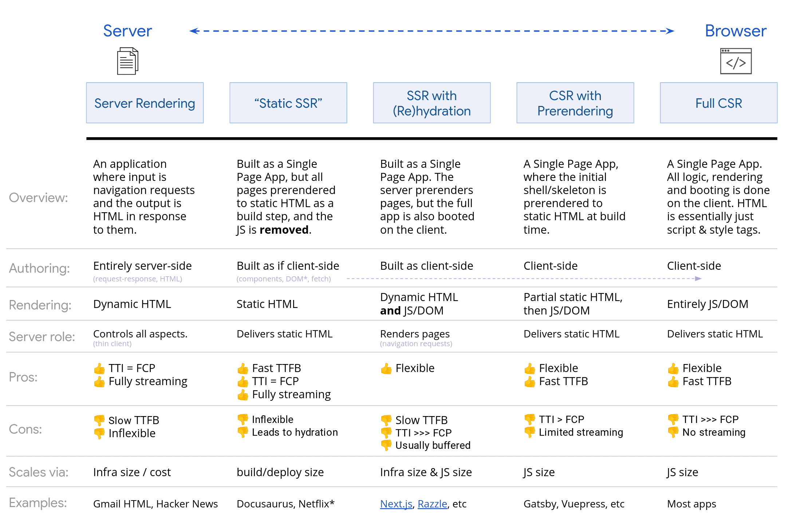

# Frontend System Design

This document contains a template, along with general questions and approaches, which can serve as a solid foundation for the answer. Naturally, it can be combined with specific details related to a particular question.

## Requirements Clarification

### Functional Requirements

1. What features should be supported?
2. Will the application be used on mobile devices?
3. What will the pages be on website?
4. What are the user's regions?
5. Must users be logged in?
6. What pagination UX should be used for the feed?

### Non-functional Requirements

1. Do we have SEO requirements? Should the website be easily discoverable by search engines?
2. What are the accessibility (a11y) requirements?
3. Should we support low-end devices?
4. Should we support low internet connections?

## Architecture / High-level Design

### Rendering Approach

Based on our requirements, we have five different options to choose from.


image source: [web.dev](https://web.dev/articles/rendering-on-the-web)

## Data model

Will be individual for each case.

## Interface Definition / API

### Backend

#### API Design

1. Follow the correct naming convention
2. Follow the correct query params convention
   
[Read more about it](https://learn.microsoft.com/en-us/azure/architecture/best-practices/api-design)

#### Pagination Approaches

1. Page + Limit page approach
2. Cursor-based approach: better for real-time feeds such as social network posts

### Frontend Components

#### Customization

1. Consider component composition. For instance, for `Select` component allow consumers to pass a custom `SelectOption` via **component prop** or **render prop**.

    ```jsx
    <Select Option={CustomOption} />
    ```

    ```jsx
    <Select renderOption={(option) => <CustomOption {...option}>} />
    ```

#### Style Customization

1. Classes overrides for each component
2. CSS Variables

## Optimizations

1. [Performance](https://github.com/Danilqa/web-performance-handbook)
2. [UX](https://evilmartians.com/chronicles/html-best-practices-for-login-and-signup-forms)